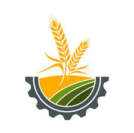

# smart_agri_app

A new Flutter project.

## Getting Started

This project is a starting point for a Flutter application.

A few resources to get you started if this is your first Flutter project:

- [Lab: Write your first Flutter app](https://docs.flutter.dev/get-started/codelab)
- [Cookbook: Useful Flutter samples](https://docs.flutter.dev/cookbook)

For help getting started with Flutter development, view the
[online documentation](https://docs.flutter.dev/), which offers tutorials,
samples, guidance on mobile development, and a full API reference.

# Smart Agriculture

## App Name
AgroPredict

## App Description
AgroPredict is an AI-powered mobile application developed using Flutter. The application helps farmers by providing crop disease detection from images and weather forecasting.
## Category
Agriculture

## Version
Version Name: 1.0.0
Version Code: 1

## App Icon

## App Screenshots

### Logo

### Login Screen

### Registration Screen

### Home Screen

### Location Permission Screen

### Weather Forecast Screen

### Disease Detection Screen

### Prediction Result Screen

### Mandi Prices Screen

## Features

- Crop Disease Detection
- Weather Forecasting
- Location-Based Services

## Permissions

### Internet Access
Used for weather information and prediction services.

### Location Access
Used to provide location-based weather forecasts.

### Gallery/Image Access
Used to select crop images for disease detection.

## Demo Video

A complete demonstration of the Smart Agriculture application is available in the `demo_video` folder.

### Features Demonstrated

- User Registration and Login
- Location Permission
- Weather Forecasting
- Crop Disease Detection
- Disease Prediction Results

Video File:

demo_video/Smart_Agriculture_Demo.mp4

## Privacy Policy

See:
privacy_policy.txt

## Technologies Used

- Flutter
- Dart
- Python Flask API
- Machine Learning
- Weather API

## Developer

Anam Imam(UL-BSCSM-B-23-46)
Natasha Akram(UL-BSCSM-B-23-46)
BS Computer Science(6th smester, section-B)
DEPARTMENT OF COMPUTER SCIENCE

## How to Use the App

Step 1: Open the App
Launch the Smart Agriculture app from your device.
Step 2: Grant Permissions
Allow required permissions:
•	Location (for weather services) 
•	Storage (for image selection) 
Step 3: Select a Feature
Choose from:
•	Crop Disease Detection 
•	Weather Forecast 
Step 4: Upload Image (if required)
Select an image from the gallery 
Step 5: View Results
The app will display analysis results or weather information.

## Academic Project

This application was developed as a Semester Project.

## GitHub

https://github.com/Anam-Imam
